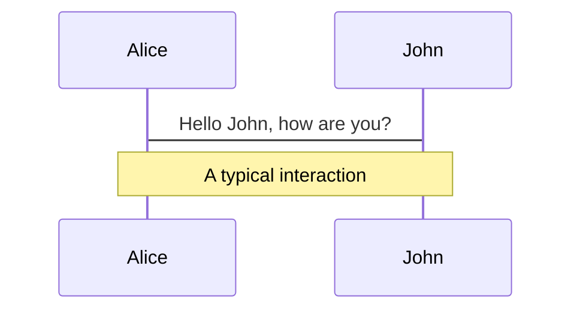
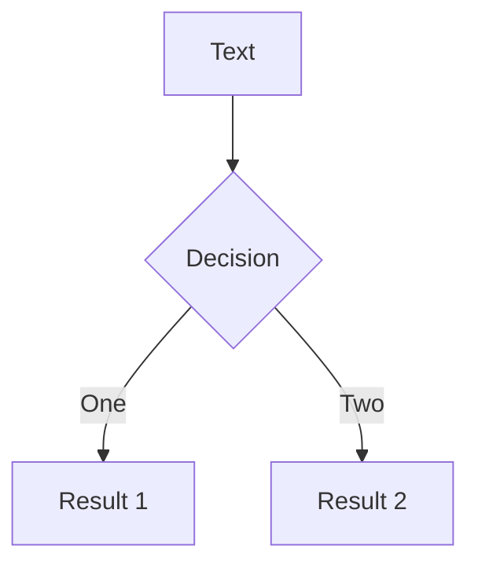
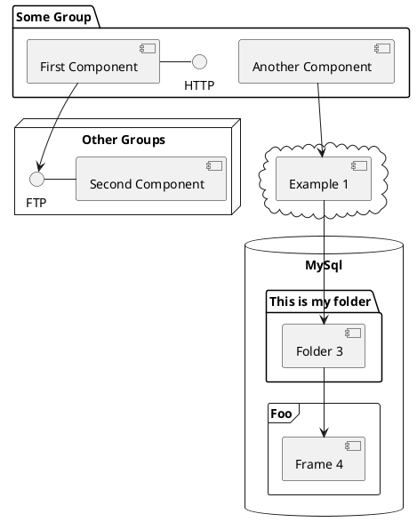

---
# try also 'default' to start simple
theme: seriph
# random image from a curated Unsplash collection by Anthony
# like them? see https://unsplash.com/collections/94734566/slidev
background: https://source.unsplash.com/collection/94734566/1920x1080
# apply any windi css classes to the current slide
class: 'text-center'
# https://sli.dev/custom/highlighters.html
highlighter: shiki
# show line numbers in code blocks
lineNumbers: false
# some information about the slides, markdown enabled
info: |
  ## Slidev Starter Template
  Presentation slides for developers.

  Learn more at [Sli.dev](https://sli.dev)
# persist drawings in exports and build
drawings:
  persist: false
# use UnoCSS (experimental)
css: unocss
---

# 前端分享

VueJS设计与实现

<div class="pt-12">
  <span @click="$slidev.nav.next" class="px-2 py-1 rounded cursor-pointer" hover="bg-white bg-opacity-10">
    Press Space to start<carbon:arrow-right class="inline"/>
  </span>
</div>

<div class="abs-br m-6 flex gap-2">
  <button @click="$slidev.nav.openInEditor()" title="Open in Editor" class="text-xl icon-btn opacity-50 !border-none !hover:text-white">
    <carbon:edit />
  </button>
  <a href="https://github.com/slidevjs/slidev" target="_blank" alt="GitHub"
    class="text-xl icon-btn opacity-50 !border-none !hover:text-white">
    <carbon-logo-github />
  </a>
</div>

<!--
The last comment block of each slide will be treated as slide notes. It will be visible and editable in Presenter Mode along with the slide. [Read more in the docs](https://sli.dev/guide/syntax.html#notes)
-->

---


# 目录
- 🧑‍💻 **早些年的前端 && 现代前端**
  - 命令式和声明式
  - 运行时和编译时
- 👏 **VueJs**
  - 渲染器
  - 组件
  - 编译器
- 🤹 **实现响应式**
  - 基本思路
  - 边界问题
<br>
<br>


<!--
You can have `style` tag in markdown to override the style for the current page.
Learn more: https://sli.dev/guide/syntax#embedded-styles
-->

<style>
h1 {
  background-color: #2B90B6;
  background-image: linear-gradient(45deg, #4EC5D4 10%, #146b8c 20%);
  background-size: 100%;
  -webkit-background-clip: text;
  -moz-background-clip: text;
  -webkit-text-fill-color: transparent;
  -moz-text-fill-color: transparent;
}
</style>

---

# 早些年的前端
一个HTML页面的基本组成

<div grid="~ cols-2 gap-4">
<div>


```html {all|1-9,20|10-14|15-19|all}
<!DOCTYPE html>
<html>
<head>
  <title>Hello World</title>
</head>
<body>
  <h1>Hello World</h1>
  <button @onclick="hello()"></button>
</body>
<script>
  function hello() {
    alert('Hello World');
  }
</script>
<style>
  h1 {
    color: red;
  }
</style>
</html>
```


</div>
<div>
运行效果:
<div bg-stone-3 p-5>
<!-- ./components/Hello.vue -->
<Hello></Hello>
</div>

|     |     |
| --- | --- |
| HTML | 页面的骨架 |
| JAVASCRIPT | 逻辑的实现 |
| CSS | 样式的呈现 |
</div>
</div>

---

# 实现一个简单的功能

``` html
<div id="app"></div>
```

现在有上面的代码片段，期望：
1. 给标签设置内容为"Hello World";
2. 当我们点击这个`div`标签时，可以弹出一个提示框，提示内容是`Hello World`。

原生JS要怎么实现？

<div v-click>

1. 根据id获取到元素
2. 使用HTML元素提供的Api可以为其设置内容
3. 为其绑定点击事件及点击时的逻辑

</div>
---

# 实现一个简单的功能


<div grid="~ cols-2 gap-4">
<div>

原生js代码实现：

```javascript
const div = document.getElementById('app');

div.innerHTML = 'Hello World';
div.addEventListener('click', function() {
  alert('Hello World');
}
```
<p v-click="1">
如果使用Vue，实现方式是什么样的？

</p>

<div v-click="3">

- 代码的实现详细的描述了我们想要的功能
- 代码本身就是"做事的过程",符合我们的逻辑直觉
- 更加的关注**过程**
</div>

<div v-click="5">
<p>

## 命令式

</p>
</div>
</div>
<div v-click="2">

Vue代码实现：

``` html 

<div @click="() => alert('Hello World')">
  Hello World
</div>


```
<p color-white> vue</p>
<div v-click="4">

- 代码描述了一个**结果**
- 具体实现的"过程",代码中并没有体现
- Vue帮我们封装了过程

</div>

<div v-click="5">
<p>

## 声明式

</p>
</div>
</div>
</div>

<style>
h2 {
  background-color: #000000;
  background-size: 100%;
  -webkit-background-clip: text;
  -moz-background-clip: text;
  -webkit-text-fill-color: transparent;
  -moz-text-fill-color: transparent;
}
</style>

---

# 现代前端框架

VueJs、React等框架

|     |     |   |
| --- | --- | --- |
| 一个网站的基本功能  | 早些年前端开发 | 现代js框架 |
| 拥有一个或者多个页面 | 几个页面即对应几个HTML | 只有一个HTML页面 |
| 多个页面之间的跳转 | 页面之间的跳转即HTML之间的跳转 | 页面组件的呈现以及跳转控制由js控制 |

<p mt-10 v-click="1">

- 业务和需求简单时，无伤大雅，甚至静态页面足矣。
- 随着业务日益复杂，前端需求和代码也变得日益复杂。
- 前端逐渐发展起来
  - less,sass等
  - react、vue、svelte等及其衍生技术
  - node, webpack, rollup等
  - ...
</p>

---

# 编译时和运行时

``` html
<div>
  <span>hello world</span>
</div>
```
观察上面的代码片段，能否抽象为一个类或者某种数据结构？


<div grid="~ cols-2 gap-4">
<div v-click="1">

``` typescript
class HELLO {
  tag: string;
  children: HELLO[] || string;
}

const basic = {
  tag: '',
  children: [],
  // children: '',
}
```

</div>
<div v-click="2">

``` javascript
const obj = {
  tag: 'div',
  children: [
    {
      tag: 'span',
      children: 'hello world'
    }
  ]
}


```
</div>
</div>

<p v-click="3">

- 根据`html`片段, 我们抽象出树状的数据结构
- 反过来想，那如果给我们树状结构的对象，我们是不是可以实现一个`Render`函数去生成`html`片段?

</p>
---

# 实现一个Render函数

<div grid="~ cols-2 gap-4">
<div>

``` javascript
function Render(obj, root) {
  const el = document.createElement(obj.tag);
  if (typeof obj.children === 'string') {
    const text = document.createTextNode(obj.children);
    el.appendChild(text);
  } else if (obj.children) {
    obj.children.forEach(child => {
      Render(child, el);
    });
  }
  root.appendChild(el);
}

```
``` javascript
// 实际使用
const obj = {
  tag: 'div',
  children: [{
      tag: 'span',
      children: 'hello world'
    }]
}
Render(obj, document.body);
```
</div>
<div>

实现思路：
1. `document.createElement`可以根据元素类型创建元素
2. `document.createTextNode`可以根据文本内容创建文本节点
3. `el.appendChild`可以将子节点添加到父节点中
4. 已知对象的数据格式，`tag`标明`html`元素类型，可根据tag来创建元素
5. `children`标明子节点的数据,但是有两种类型
  * 当其为string时，表示文本节点，创建文字节点添加
  * 当其为数组时，表示子节点的数组，递归调用`Render`函数


</div>
</div>
---

# 实现一个Render函数

<p>
我们刚刚编写的`Render`函数，其实可以算是一个微型的**纯运行时**的框架。
</p>
思考它的不足，可以发现：
<p v-click="1">

- 我们每次使用的时候，都必须手动去写树形结构的数据对象，这样是不是太麻烦了？
- 这样写出来的代码，并不直观
</p>
<p v-click="2">
能不能支持类似于HTML标签的方式描述树形结构的数据对象呢？
</p>

---

# 编译时

``` javascript
  const html  = `
  <div>
    <span>hello world</span>
  </div>
  `;

  const obj = Compiler(html);

  Render(obj, document.body);
```
<p>
上面的代码片段给出了我们理想中的使用场景
</p>
<p v-click="1">

`Compiler`是我们要实现的函数
- 入参：`html`模板字符串
- 出参：前文中我们定义的树状结构的对象
</p>
<p v-click="1">

至此, 我们实现了一个**运行时** + **编译时**的框架; 
而且我们的`Render`函数和`Compiler`可以分别使用，也可以一起使用。我们可以在用户运行代码时，**运行时编译**;也可以构建时就先进行编译，运行的时候就无须编译了，这对性能提升来说是非常有效的。
</p>
---

# Navigation

Hover on the bottom-left corner to see the navigation's controls panel, [learn more](https://sli.dev/guide/navigation.html)

### Keyboard Shortcuts

|     |     |
| --- | --- |
| <kbd>right</kbd> / <kbd>space</kbd>| next animation or slide |
| <kbd>left</kbd>  / <kbd>shift</kbd><kbd>space</kbd> | previous animation or slide |
| <kbd>up</kbd> | previous slide |
| <kbd>down</kbd> | next slide |

<!-- https://sli.dev/guide/animations.html#click-animations -->

<p v-after class="absolute bottom-23 left-45 opacity-30 transform -rotate-10">Here!</p>

---
layout: image-right
image: https://source.unsplash.com/collection/94734566/1920x1080
---

# Code

Use code snippets and get the highlighting directly![^1]

```ts {all|2|1-6|9|all}
interface User {
  id: number
  firstName: string
  lastName: string
  role: string
}

function updateUser(id: number, update: User) {
  const user = getUser(id)
  const newUser = { ...user, ...update }
  saveUser(id, newUser)
}
```

<arrow v-click="3" x1="400" y1="420" x2="230" y2="330" color="#564" width="3" arrowSize="1" />

[^1]: [Learn More](https://sli.dev/guide/syntax.html#line-highlighting)

<style>
.footnotes-sep {
  @apply mt-20 opacity-10;
}
.footnotes {
  @apply text-sm opacity-75;
}
.footnote-backref {
  display: none;
}
</style>

---

# Components

<div grid="~ cols-2 gap-4">
<div>

You can use Vue components directly inside your slides.

We have provided a few built-in components like `<Tweet/>` and `<Youtube/>` that you can use directly. And adding your custom components is also super easy.

```html
<Counter :count="10" />
```

<!-- ./components/Counter.vue -->
<Counter :count="10" m="t-4" />

Check out [the guides](https://sli.dev/builtin/components.html) for more.

</div>
<div>

```html
<Tweet id="1390115482657726468" />
```

<Tweet id="1390115482657726468" scale="0.65" />

</div>
</div>


---
class: px-20
---

# Themes

Slidev comes with powerful theming support. Themes can provide styles, layouts, components, or even configurations for tools. Switching between themes by just **one edit** in your frontmatter:

<div grid="~ cols-2 gap-2" m="-t-2">

```yaml
---
theme: default
---
```

```yaml
---
theme: seriph
---
```


</div>

Read more about [How to use a theme](https://sli.dev/themes/use.html) and
check out the [Awesome Themes Gallery](https://sli.dev/themes/gallery.html).

---
preload: false
---

# Animations

Animations are powered by [@vueuse/motion](https://motion.vueuse.org/).

```html
<div
  v-motion
  :initial="{ x: -80 }"
  :enter="{ x: 0 }">
  Slidev
</div>
```

<div class="w-60 relative mt-6">
  <div class="relative w-40 h-40">
    
    
    
  </div>

  <div
    class="text-5xl absolute top-14 left-40 text-[#2B90B6] -z-1"
    v-motion
    :initial="{ x: -80, opacity: 0}"
    :enter="{ x: 0, opacity: 1, transition: { delay: 2000, duration: 1000 } }">
    Slidev
  </div>
</div>

<!-- vue script setup scripts can be directly used in markdown, and will only affects current page -->
<script setup lang="ts">
const final = {
  x: 0,
  y: 0,
  rotate: 0,
  scale: 1,
  transition: {
    type: 'spring',
    damping: 10,
    stiffness: 20,
    mass: 2
  }
}
</script>

<div
  v-motion
  :initial="{ x:35, y: 40, opacity: 0}"
  :enter="{ y: 0, opacity: 1, transition: { delay: 3500 } }">

[Learn More](https://sli.dev/guide/animations.html#motion)

</div>

---

# LaTeX

LaTeX is supported out-of-box powered by [KaTeX](https://katex.org/).

<br>

Inline $\sqrt{3x-1}+(1+x)^2$

Block
$$
\begin{array}{c}

\nabla \times \vec{\mathbf{B}} -\, \frac1c\, \frac{\partial\vec{\mathbf{E}}}{\partial t} &
= \frac{4\pi}{c}\vec{\mathbf{j}}    \nabla \cdot \vec{\mathbf{E}} & = 4 \pi \rho \\

\nabla \times \vec{\mathbf{E}}\, +\, \frac1c\, \frac{\partial\vec{\mathbf{B}}}{\partial t} & = \vec{\mathbf{0}} \\

\nabla \cdot \vec{\mathbf{B}} & = 0

\end{array}
$$

<br>

[Learn more](https://sli.dev/guide/syntax#latex)

---

# Diagrams

You can create diagrams / graphs from textual descriptions, directly in your Markdown.

<div class="grid grid-cols-3 gap-10 pt-4 -mb-6">







</div>

[Learn More](https://sli.dev/guide/syntax.html#diagrams)


---
layout: center
class: text-center
---

# Learn More

[Documentations](https://sli.dev) · [GitHub](https://github.com/slidevjs/slidev) · [Showcases](https://sli.dev/showcases.html)
